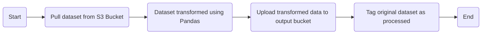

# AWS Lambda Data Preprocessing

[](https://www.python.org/downloads/release/python-3121/)
[](https://github.com/kwame-mintah/aws-lambda-data-preprocessing/actions/workflows/bump-repository-version.yml)
[](https://github.com/kwame-mintah/aws-lambda-data-preprocessing/actions/workflows/push-docker-image-to-aws-ecr.yml)
[](https://github.com/kwame-mintah/aws-lambda-data-preprocessing/actions/workflows/run-linter.yml)
<a href="https://github.com/psf/black"></a>

A lambda to perform data pre-processing on new data put into an S3 bucket. An assumption has been made that new data
uploaded will be of the same format e.g. same features, data schema etc. Actions performed not limited to removing missing
data, imputing numerical values and/or categorical values etc.

This repository does not create the S3 Bucket, this is created via Terraform found here [terraform-aws-machine-learning-pipeline](https://github.com/kwame-mintah/terraform-aws-machine-learning-pipeline).
Data uploaded into these buckets can be found here [ml-data-copy-to-aws-s3](https://github.com/kwame-mintah/ml-data-copy-to-aws-s3). Additionally, data preparation is
specific to a specific set of data found within the GitHub repository.

# Flowchart

The [diagram below](https://mermaid.js.org/syntax/flowchart.html#flowcharts-basic-syntax) demonstrates what happens when the lambda is trigger, when a new `.csv` object has been uploaded to the S3 Bucket.



## Development

### Dependencies

- [Python](https://www.python.org/downloads/release/python-3120/)
- [Docker for Desktop](https://www.docker.com/products/docker-desktop/)
- [Amazon Web Services](https://aws.amazon.com/?nc2=h_lg)

## Usage

1. Build the docker image locally:

   ```commandline
   docker build --no-cache -t data-preprocessing:local .
   ```

2. Run the docker image built:

   ```commandline
   docker run --platform linux/amd64 -p 9000:8080 data-preprocessing:local
   ```

3. Send an event to the lambda via curl:
   ```commandline
   curl "http://localhost:9000/2015-03-31/functions/function/invocations" -d '{<REPLACE_WITH_JSON_BELOW>}'
   ```
   ```json
   {
     "Records": [
       {
         "eventVersion": "2.1",
         "eventSource": "aws:s3",
         "awsRegion": "eu-west-2",
         "eventTime": "2023-12-01T21:48:58.339Z",
         "eventName": "ObjectCreated:Put",
         "userIdentity": { "principalId": "AWS:ABCDEFGHIJKLMNOPKQRST" },
         "requestParameters": { "sourceIPAddress": "127.0.0.1" },
         "responseElements": {
           "x-amz-request-id": "BY65CG6WZD6HBVX2",
           "x-amz-id-2": "c2La85nMEE2WBGPHBXDc5a8fd28kEpGt/QsP8n/xmbLv0ZAJeqsK/XmNcCCS+phWuVz8KP3/gn3Ql3/z7RPyC3n176rqpzvZ"
         },
         "s3": {
           "s3SchemaVersion": "1.0",
           "configurationId": "huh",
           "bucket": {
             "name": "example-bucket-name",
             "ownerIdentity": { "principalId": "ABCDEFGHIJKLMN" },
             "arn": "arn:aws:s3:::example-bucket-name"
           },
           "object": {
             "key": "data/bank-additional.csv",
             "size": 515246,
             "eTag": "0e29c0d99c654bbe83c42097c97743ed",
             "sequencer": "00656A54CA3D69362D"
           }
         }
       }
     ]
   }
   ```

## GitHub Action (CI/CD)

The GitHub Action "🚀 Push Docker image to AWS ECR" will check out the repository and push a docker image to the chosen AWS ECR using
[configure-aws-credentials](https://github.com/aws-actions/configure-aws-credentials/tree/v4.0.1/) action. The following repository secrets need to be set:

| Secret             | Description                  |
| ------------------ | ---------------------------- |
| AWS_REGION         | The AWS Region.              |
| AWS_ACCOUNT_ID     | The AWS account ID.          |
| AWS_ECR_REPOSITORY | The AWS ECR repository name. |
